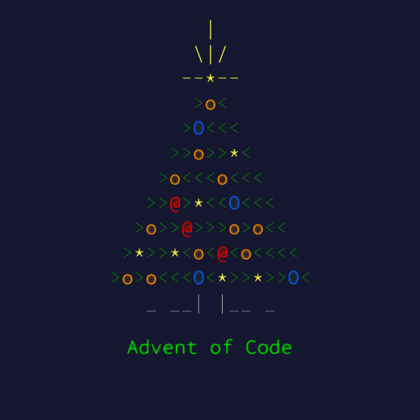

<div align="center">
    

  <h1 align="center">Advent of Code</h1>

  [Advent of Code](https://adventofcode.com/2023/about) is an Advent calendar of small programming puzzles for a variety of skill sets and skill levels that can be solved in any programming language you like, created by [Eric Wastl](http://was.tl/).

  I love the aspect of Advent of Code and want to participate it in every year. I started late, but intend on retroactively going back and completing available puzzles from previous years eventually.

  
  <a href="https://visitorbadge.io/status?path=https%3A%2F%2Fgithub.com%2FToxocious%AdventOfCode">
    
  </a>
  <br />

  <a href="https://discord.gg/Km6btPhs" target="_blank">
    
  </a>
</div>


## Table of Contents
- [Table of Contents](#table-of-contents)
- [Day 01](#day-01)
- [Part One](#part-one)
  - [Solution](#solution)
- [Part Two](#part-two)
  - [Solution](#solution-1)


## Day 01
In this README, we will go over the solutions for part one and part two of today's puzzle.

You can find today's puzzle [HERE](https://adventofcode.com/2023/day/1).


## Part One
The newly-improved calibration document consists of lines of text; each line originally contained a specific calibration value that the Elves now need to recover. On each line, the calibration value can be found by combining the **first digit** and the **last digit** (in that order) to form a single two-digit number.

For example:
```
1abc2
pqr3stu8vwx
a1b2c3d4e5f
treb7uchet
```
In this example, the calibration values of these four lines are `12`, `38`, `15`, and `77`. Adding these together produces `142`.

Consider your entire calibration document. What is the sum of all of the calibration values?

### Solution
You can find my solution for part one [HERE](./src/part1.rs).

Let's go through my solution step-by-step and walk through what's being done.

```rs
/**
 * 1. Take the provided `input` and split it into lines of strings
 */
let output = _input
    .lines()
    /**
     * 2. We iterate over each line
     */
    .map(|line| {
        /**
         * 3. From each line, we get the characters and then filter out all non-base 10 decimal characters
         *    This leaves only 1, 2, 3, 4, 5, 6, 7, 8, 9, and 0 inside of the string
         */
        let mut nums =
            line.chars().filter_map(|character| {
                character.to_digit(10)
            });

        /**
         * 4. We get the first number that appears in the current line
         */
        let first = nums.next().expect("Should be a number");

        /**
         * 5. We check if there's a number that appears after the first number
         *    If there is, we concatenate it to the first number
         *    If there isn't, we concatenate the first number to itself
         */
        match nums.last() {
            Some(last) => format!("{first}{last}"),
            None => format!("{first}{first}"),
        }
        /**
         * 6. We want to parse the returned match as a u32 interger
         */
        .parse::<u32>()
        /**
         * 7. We expect that the returned match is a valid number
         */
        .expect("Should be a valid number")
    })
    /**
     * 8. We sum all returned numbers together as a u32 to get our answer
     */
    .sum::<u32>();

/**
 * 9. Now we return the output as a string
 */
Ok(output.to_string())
```


## Part Two
Part two extends upon part one and now expects you to factor in the English spelling of the numbers 1 through 9.

Your calculation isn't quite right. It looks like some of the digits are actually spelled out with letters: `one`, `two`, `three`, `four`, `five`, `six`, `seven`, `eight`, and `nine` also count as valid "digits".

Equipped with this new information, you now need to find the real first and last digit on each line. For example:
```
two1nine
eightwothree
abcone2threexyz
xtwone3four
4nineeightseven2
zoneight234
7pqrstsixteen
```
In this example, the calibration values are `29`, `83`, `13`, `24`, `42`, `14`, and `76`. Adding these together produces `281`.

What is the sum of all of the calibration values?

### Solution
You can find my solution for part one [HERE](./src/part2.rs).

Let's go through my solution step-by-step and walk through what's being done.

> I've condensed the actual solution answer into a single block here instead of separating it out like in my solution file, but the concept remains the same.

```rs
/**
 * 1. Take the provided `input` and split it into lines of strings
 */
let output = _input
    .lines()
    /**
     * 2. We iterate over each line
     */
    .map(|line| {
        /**
         * 3. Normalize the string by replacing spelled out numbers with their correct digits.
         *    We keep track of the index that we're at so we can go through the line
         *    If, at our current index, we find a spelled out number, we replace the word with the digit
         */
        let mut index = 0;
        let line_iter = std::iter::from_fn(move || {
            let line_mod = &line[index..];

            let result = if line_mod.starts_with("one") {
                Some('1')
            } else if line_mod.starts_with("two") {
                Some('2')
            } else if line_mod.starts_with("three") {
                Some('3')
            } else if line_mod.starts_with("four") {
                Some('4')
            } else if line_mod.starts_with("five") {
                Some('5')
            } else if line_mod.starts_with("six") {
                Some('6')
            } else if line_mod.starts_with("seven") {
                Some('7')
            } else if line_mod.starts_with("eight") {
                Some('8')
            } else if line_mod.starts_with("nine") {
                Some('9')
            } else {
                let result = line_mod.chars().next();
                result
            };

            index += 1;

            result
        });

        /**
         * 4. From the current line, we get the characters and then filter out all remaining non-base 10 decimal characters
         *    This leaves only 1, 2, 3, 4, 5, 6, 7, 8, 9, and 0 inside of the string
         */
        let mut nums =
            line_iter.filter_map(|character| character.to_digit(10));

        /**
         * 5. We get the first number that appears in the current line
         */
        let first = nums.next().expect("Should be a number");

        /**
         * 6. We check if there's a number that appears after the first number
         *    If there is, we concatenate it to the first number
         *    If there isn't, we concatenate the first number to itself
         */
        match nums.last() {
            Some(last) => format!("{first}{last}"),
            None => format!("{first}{first}"),
        }
        /**
         * 7. We want to parse the returned match as a u32 interger
         */
        .parse::<u32>()
        /**
         * 8. We expect that the returned match is a valid number
         */
        .expect("Should be a valid number")
    })
    /**
     * 9. We sum all returned numbers together as a u32 to get our answer
     */
    .sum::<u32>();

/**
 * 10. Now we return the output as a string
 */
Ok(output.to_string())
```
